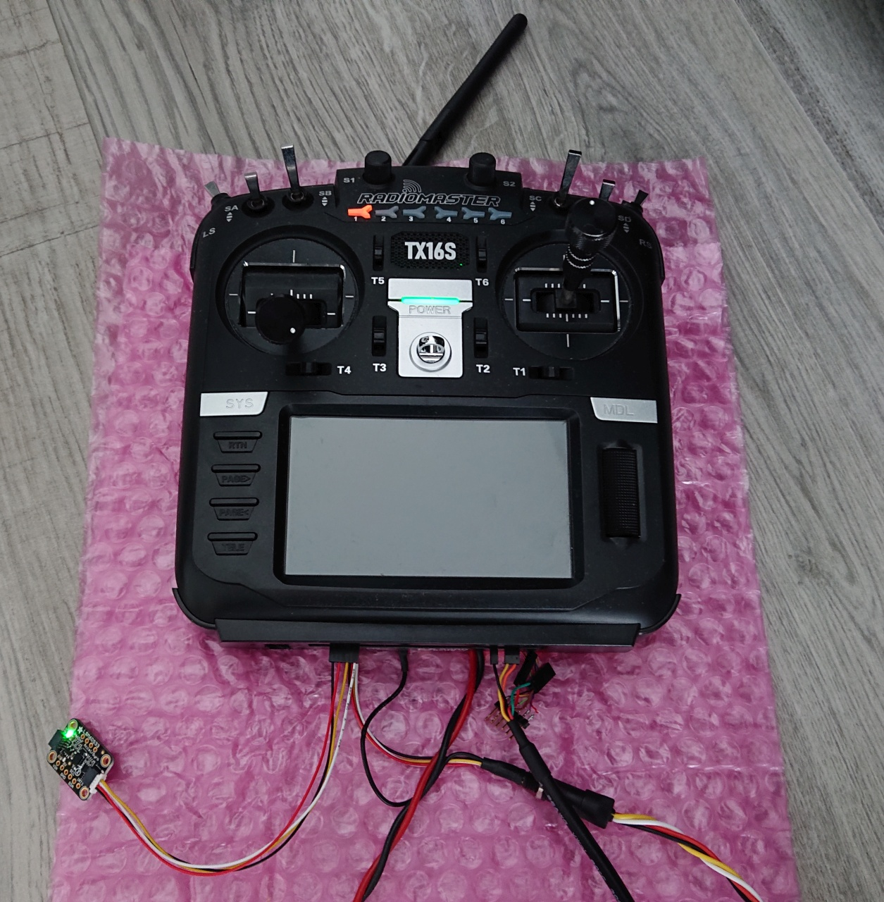

# RadioMaster TX16S Hall stick drift compensation

Test software for the RadioMaster TX16S hall sticks. Using [ST LSM6DS33](https://www.st.com/en/mems-and-sensors/lsm6ds33.html) as a temperature reference.

An example hookup of [Adafruit LSM6DS33 breakout board](https://www.adafruit.com/product/4480) connected to TX16S AUX1:



The source code is to be used with [STM32CubeIDE](https://www.st.com/en/development-tools/stm32cubeide.html). It reconfigures the original serial port USART3 at AUX1 on STM32F429BIT6 to I2C bus (I2C2) and enables the 5V power output of AUX1. Debug output is available at USART6/AUX2 with 400.000 baud 8N1.

Hookup between RadioMaster TX16S AUX1 port and Adafruit LSM6DS33 breakout board:

* TX16S AUX1 RX - Adafruit LSM6DS33 SDA
* TX16S AUX1 TX - Adafruit LSM6DS33 SCL
* TX16S AUX1 5V - Adafruit LSM6DS33 VIN
* TX16S AUX1 GND - Adafruit LSM6DS33 GND

Via TX16S AUX2/USART6 you can expect human readable output of the IMU such as (an example line):
```
Temp.: 24.98 deg C, AccXYZ: 2.21 -3.55 9.17, GyroXYZ: 0.04, -0.11, -0.04
```

A brief press on the power button turns on the radio, a press longer than 1 second, turns the radio off again.
